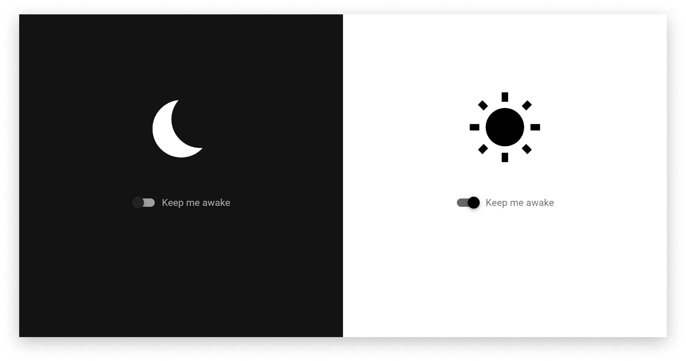

# `keep-me-awake`

A dirty web-based workaround for keeping computers awake.

This works by playing an inaudible-to-hooman tone (10Hz) indefinitely in background when toggled on.

## Featuring

- Vue 3-ish (still no `setup()`) & [Vuetify 3 alpha](https://next.vuetifyjs.com/en)
- [Web Audio API](https://developer.mozilla.org/en-US/docs/Web/API/Web_Audio_API) (specifically [this answer](https://stackoverflow.com/a/16573282) from StackOverflow)
- [Bootstrapped with Vite](https://vitejs.dev/)
